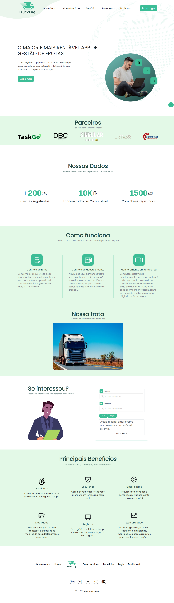
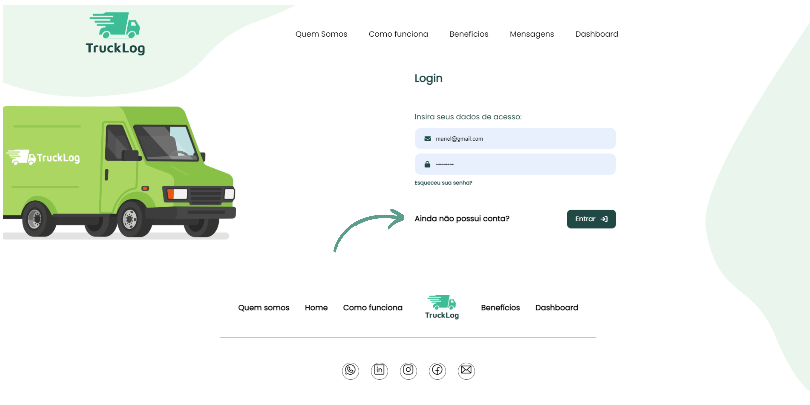
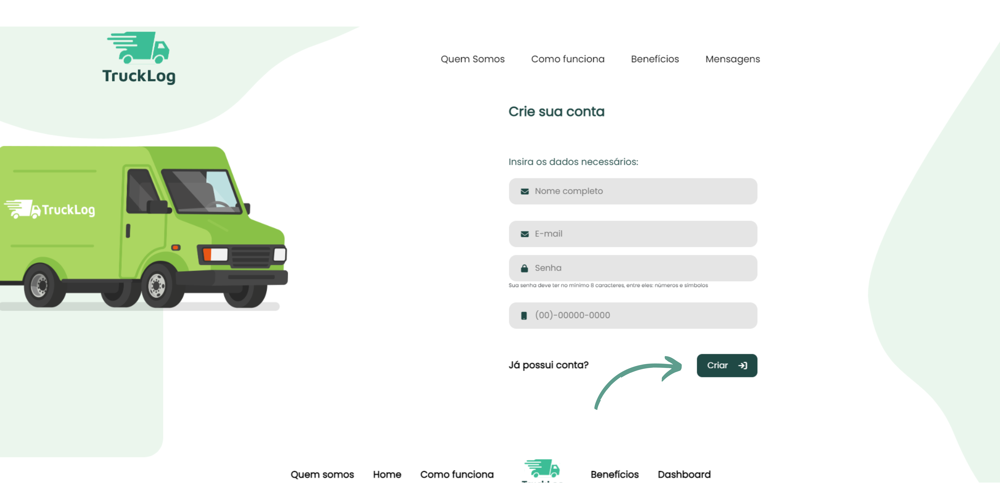
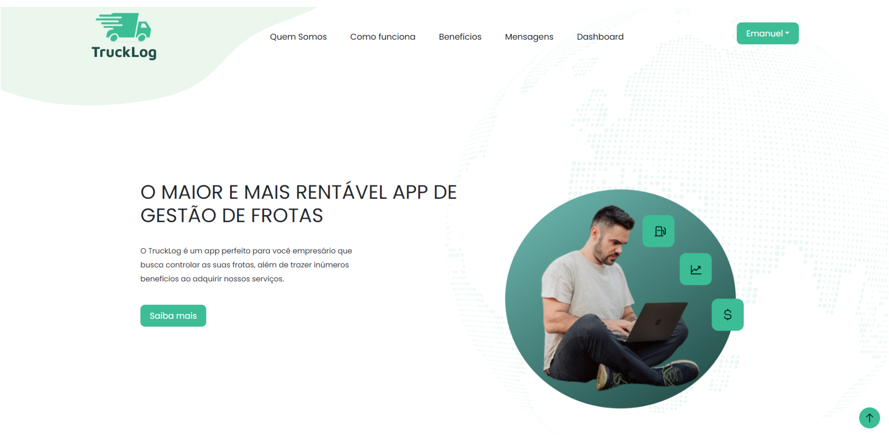

<h1 align="center">TruckLog App</h1>

Projeto desenvolvido através do programa vem ser da DBC Company durante o módulo de HTML e CSS (Aprimorado com Javascript) 

  <a href="#-tecnologias">Tecnologias</a>&nbsp;&nbsp;&nbsp;|&nbsp;&nbsp;&nbsp;
  <a href="#-projeto">Projeto</a>&nbsp;&nbsp;&nbsp;|&nbsp;&nbsp;&nbsp;
  <a href="#-licença">Licença</a>

Utilizamos o json-server para as mensagens, login e signin.  
  

  

  <a href="https://trucklog-three.vercel.app/index.html" target="_blank">😁 -> Acesse o deploy do projeto!</a>

 

## 🚀 Instruções de Login/Cadastro

Passos para você realizar seu login e/ou Cadastrar seu usuário.

1º passo: Ao entrar na página, clicar no botão de "login" no canto superior direito.

  

2º passo: Se você possuir cadastro, colocar seu e-mail e senhas nas caixas destinadas e clicar no botão "entrar". Se não possuir cadastro, clicar no link "Ainda não possui conta?" 

  

3º passo: Para realizar o seu cadastro é necessário informar seu nome completo, seu email, uma senha com pelo menos 8 caracteres, sendo pelo menos 1 maiúscula, 1 número e um caractere especial (!, @, $, %, . , ....). Após preencher os campos corretamente, clicar no botão "criar", assim aparecendo uma mensagem confirmando seu cadastro.

  

4º passo: Realizar o passo 1 e 2 novamente, porém logando sua conta na página de login e pronto, você estará logado no site do trucklog, podendo aproveitar alguns conteúdos exclusivos para usuários, como visualizar o dashboard.

  

## 🚀 Tecnologias

Esse projeto foi desenvolvido com as seguintes tecnologias:

- HTML
- CSS (Flexbox , Bootstrap)
- Javascript
- Json-Server
- Git e Github
- Phosphor Icons - CDN

## 💻 Projeto

O objetivo desta task era criarmos uma Landing Page baseado em um tema de uma empresa cliente da DBC.

> Nosso tema foi: Landing Page de Sistema de controle de rotas e abastecimento com gestão de frotas.

- Pesquisa de UX Writing
  - [Google Docs](https://docs.google.com/document/d/1ontmQ_qB8j491NnT3CsPw-lCrYg9HHDQ6SQwGpKq87M/edit)
- Board
  - [Trello](https://trello.com/invite/b/GgHQludT/ATTI31cc9fe907da6ac40fec6ff4af4f0437278ADC48/truckgo)
- Design
  - [Figma](https://www.figma.com/file/FwkYMhKGb1aMaJJGCuktUZ/TruckLog---App?node-id=0%3A1&t=YdRgavpASouSpN8x-1)

## 🔘 Licença

Esse projeto está sob a licença MIT.

---

